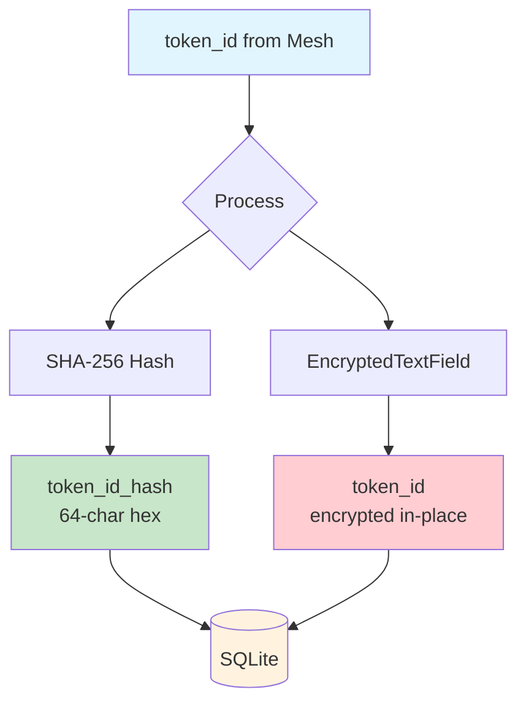
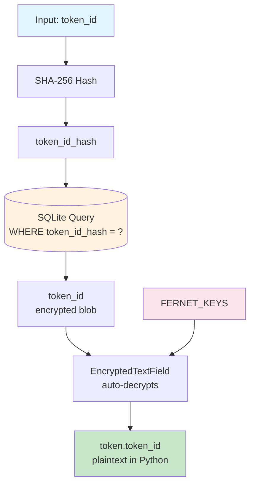
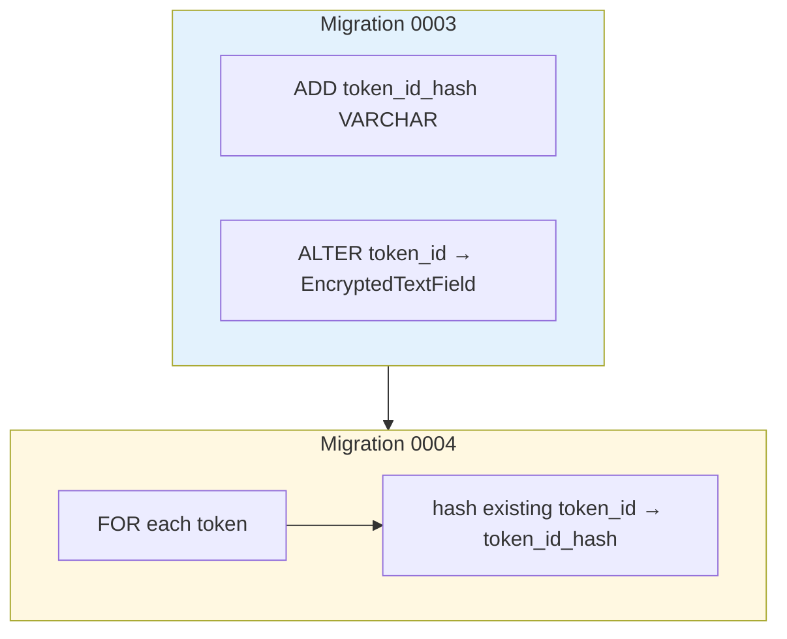
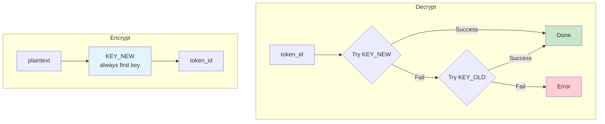
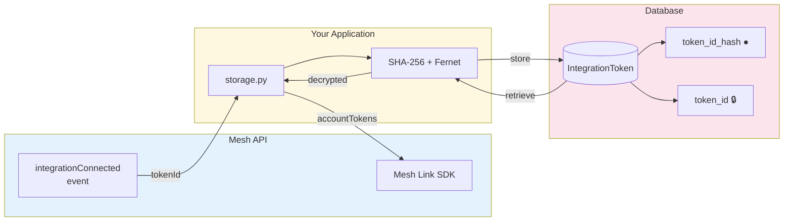

# Plan: Secure MMT Token Storage with Django Encryption

## Problem Statement

MMT `token_id` values are stored as plaintext in SQLite. These tokens grant persistent access to user exchange accounts (Coinbase, Binance) and should be encrypted at rest.

**Current state**: `IntegrationToken.token_id` is a plain `CharField`
**Goal**: Encrypt `token_id` at rest while preserving lookup capability

---

## Architecture Overview

```
┌─────────────────────────────────────────────────────────────┐
│                    IntegrationToken                         │
├─────────────────────────────────────────────────────────────┤
│ token_id_hash   VARCHAR(64)  [indexed, searchable]         │
│ token_id        BLOB         [encrypted in-place]          │
│ integration_type VARCHAR(64) [indexed]                     │
│ user_id         VARCHAR(255) [indexed]                     │
│ ...                                                         │
└─────────────────────────────────────────────────────────────┘

Lookup flow:
1. hash(token_id) → query token_id_hash
2. Decrypt token_id (automatic via EncryptedTextField)

Storage flow:
1. Store hash(token_id) in token_id_hash
2. Store token_id (auto-encrypted by field type)
```

---

## Flow Diagrams

### Store Token Flow



### Get Token Flow



### Data Migration Flow



### Key Rotation Flow



### Complete System Overview



---

## Implementation Plan

### Phase 1: Add Encryption Infrastructure

**1.1 Add dependency**
```toml
# pyproject.toml - add to [project.optional-dependencies] django
"django-fernet-fields>=0.6",
```

**1.2 Configure encryption key**
```python
# settings.py
import os

# Separate key for field encryption (NOT the same as SECRET_KEY)
# Generate with: python -c "from cryptography.fernet import Fernet; print(Fernet.generate_key().decode())"
FERNET_KEYS = [os.environ.get('FIELD_ENCRYPTION_KEY', 'CHANGE_ME_IN_PROD')]
```

---

### Phase 2: Model Changes

**2.1 Update model (in-place encryption)**
```python
# meshsbox/models.py
import hashlib
from fernet_fields import EncryptedTextField

def token_hash(token_id: str) -> str:
    """SHA-256 hash for searchable index."""
    return hashlib.sha256(token_id.encode()).hexdigest()

class IntegrationToken(models.Model):
    token_id = EncryptedTextField()  # Changed from CharField - auto encrypts/decrypts
    token_id_hash = models.CharField(max_length=64, db_index=True)  # NEW: for lookups
    # ... rest unchanged
```

**2.2 Migration 0003: Schema changes**
```python
# Auto-generated by makemigrations, then edited
operations = [
    migrations.AddField(
        model_name='integrationtoken',
        name='token_id_hash',
        field=models.CharField(max_length=64, db_index=True, null=True),
    ),
    migrations.AlterField(
        model_name='integrationtoken',
        name='token_id',
        field=fernet_fields.EncryptedTextField(),
    ),
]
```

**2.3 Migration 0004: Populate hashes**
```python
def populate_hashes(apps, schema_editor):
    """Hash existing token_ids for lookup index."""
    IntegrationToken = apps.get_model('meshsbox', 'IntegrationToken')
    for token in IntegrationToken.objects.all():
        token.token_id_hash = hashlib.sha256(token.token_id.encode()).hexdigest()
        token.save(update_fields=['token_id_hash'])

operations = [
    migrations.RunPython(populate_hashes, migrations.RunPython.noop),
    migrations.AlterField(
        model_name='integrationtoken',
        name='token_id_hash',
        field=models.CharField(max_length=64, db_index=True),  # Remove null=True
    ),
]
```

---

### Phase 3: Update Storage API

**3.1 Update storage.py functions**
```python
from meshsbox.models import token_hash

def store_token(token_id: str, ...):
    """Store with encryption (automatic via field type)."""
    IntegrationToken.objects.update_or_create(
        token_id_hash=token_hash(token_id),
        integration_type=integration_type,
        defaults={
            'token_id': token_id,  # EncryptedTextField handles encryption
            ...
        }
    )

def get_token(token_id: str, ...):
    """Lookup by hash, decryption is automatic."""
    return IntegrationToken.objects.filter(
        token_id_hash=token_hash(token_id)
    ).first()
```

No property shim needed — `token.token_id` works as before, just encrypted at rest.

---

### Phase 4: Key Management

**4.1 Environment variable setup**
```bash
# .env or environment
FIELD_ENCRYPTION_KEY=<base64-fernet-key>
```

**4.2 Key rotation support** (future)
```python
# settings.py - Fernet supports key rotation
FERNET_KEYS = [
    os.environ.get('FIELD_ENCRYPTION_KEY'),      # Current key
    os.environ.get('FIELD_ENCRYPTION_KEY_OLD'),  # Previous key (for decryption only)
]
```

---

## File Changes Summary

| File | Change |
|------|--------|
| `pyproject.toml` | Add `django-fernet-fields` dependency |
| `meshc_django/meshc_django/settings.py` | Add `FERNET_KEYS` config |
| `meshc_django/meshsbox/models.py` | Add `token_hash()`, change `token_id` field type, add `token_id_hash` |
| `meshc_django/meshsbox/migrations/0003_*.py` | Add hash column, alter token_id to EncryptedTextField |
| `meshc_django/meshsbox/migrations/0004_*.py` | Populate hashes, remove null constraint |
| `src/meshc/storage.py` | Update lookups to use `token_id_hash` |

---

## Security Considerations

1. **Key separate from SECRET_KEY**: Encryption key is independent, can rotate without breaking sessions
2. **Hash for lookups**: SHA-256 allows O(1) lookups without exposing token values
3. **At-rest encryption**: Fernet uses AES-128-CBC with HMAC verification
4. **No logging of tokens**: Ensure decrypted values never appear in logs

---

## Testing Plan

1. Unit test: encrypt/decrypt round-trip
2. Unit test: hash lookup returns correct token
3. Migration test: existing tokens migrated correctly
4. Integration test: full store → get → revoke flow

---

## Rollback Plan

Django migrations are reversible by default:
```bash
python manage.py migrate meshsbox 0002  # Revert to pre-encryption state
```

The `AlterField` operation is reversible — Django will convert the field back to CharField.
