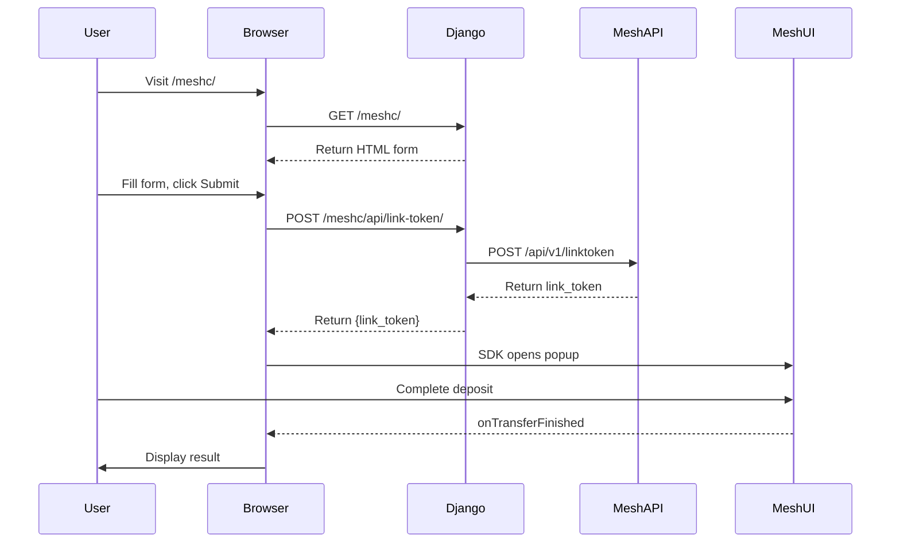

# Django Frontend for meshc

## Overview

A self-service web frontend for generating Mesh link tokens. Users fill a form, Django calls the Mesh API, and the browser opens the Mesh Link popup.

**Design Decisions:**
- **No DRF** - Plain Django views with `JsonResponse`. Two endpoints don't need a framework.
- **No Auth** - Sandbox/dev tool. Add authentication before production use.
- **No Database** - Stateless. Token storage stays in CLI via Peewee.
- **Separate from CLI** - Django is self-service; CLI `--local` uses `web/link.html`.

---

## User Flow



---

## Project Structure

```
meshc_django/
├── manage.py
├── meshc_django/
│   ├── settings.py
│   ├── urls.py
│   └── wsgi.py
└── meshsbox/                     # Named 'meshsbox' to avoid conflict with meshc library
    ├── views.py
    ├── urls.py
    └── templates/meshsbox/link.html
```

---

## Prerequisites

Export `create_sandbox_wallet_token` from `src/meshc/__init__.py`:

```python
from .core import (
    ...
    create_sandbox_wallet_token,
)

__all__ = [
    ...
    "create_sandbox_wallet_token",
]
```

---

## Views

```python
# meshsbox/views.py
import json
from django.shortcuts import render
from django.http import JsonResponse
from django.views.decorators.csrf import csrf_exempt
from django.views.decorators.http import require_POST

from meshc import create_sandbox_cex_token, create_sandbox_wallet_token, load_config


def index(request):
    """Render the self-service form."""
    return render(request, 'meshsbox/link.html')


@csrf_exempt
@require_POST
def api_link_token(request):
    """Generate Mesh link token.

    POST /meshc/api/link-token/
    {
        "address": "GBXY...",      # Required
        "symbol": "USDC",          # Default: USDC
        "amount": 100.0,           # Optional
        "wallet": false            # true for Sepolia wallet mode
    }
    """
    try:
        data = json.loads(request.body)
    except json.JSONDecodeError:
        return JsonResponse({'error': 'Invalid JSON'}, status=400)

    address = data.get('address')
    if not address:
        return JsonResponse({'error': 'address is required'}, status=400)

    config = load_config()
    user_id = data.get('user_id', 'web-user')
    symbol = data.get('symbol', 'USDC')
    amount = data.get('amount')
    wallet_mode = data.get('wallet', False)

    try:
        if wallet_mode:
            result = create_sandbox_wallet_token(
                client_id=config['client_id'],
                client_secret=config['client_secret'],
                user_id=user_id,
                to_address=address,
                symbol=symbol,
                amount=amount,
                api_url=config['api_url'],
            )
        else:
            result = create_sandbox_cex_token(
                client_id=config['client_id'],
                client_secret=config['client_secret'],
                user_id=user_id,
                to_address=address,
                symbol=symbol,
                amount=amount,
                api_url=config['api_url'],
            )

        return JsonResponse({
            'link_token': result.token,
            'expires_at': result.expires_at,
        })
    except Exception as e:
        return JsonResponse({'error': str(e)}, status=500)
```

---

## URLs

```python
# meshc_django/urls.py
from django.urls import path, include

urlpatterns = [
    path('meshc/', include('meshsbox.urls')),
]
```

```python
# meshsbox/urls.py
from django.urls import path
from . import views

urlpatterns = [
    path('', views.index, name='index'),
    path('api/link-token/', views.api_link_token, name='api_link_token'),
]
```

---

## Settings

```python
# meshc_django/settings.py
from pathlib import Path
import os

BASE_DIR = Path(__file__).resolve().parent.parent

SECRET_KEY = os.environ.get('DJANGO_SECRET_KEY', 'dev-only-change-in-prod')
DEBUG = os.environ.get('DJANGO_DEBUG', 'true').lower() == 'true'
ALLOWED_HOSTS = ['localhost', '127.0.0.1']

INSTALLED_APPS = [
    'django.contrib.contenttypes',
    'django.contrib.staticfiles',
    'meshsbox',
]

MIDDLEWARE = [
    'django.middleware.security.SecurityMiddleware',
    'django.middleware.common.CommonMiddleware',
]

ROOT_URLCONF = 'meshc_django.urls'

TEMPLATES = [{
    'BACKEND': 'django.template.backends.django.DjangoTemplates',
    'DIRS': [],
    'APP_DIRS': True,
    'OPTIONS': {
        'context_processors': ['django.template.context_processors.request'],
    },
}]

STATIC_URL = 'static/'
DEFAULT_AUTO_FIELD = 'django.db.models.BigAutoField'
```

---

## Template

```html
<!-- meshc/templates/meshc/link.html -->
<!DOCTYPE html>
<html lang="en">
<head>
  <meta charset="UTF-8">
  <meta name="viewport" content="width=device-width, initial-scale=1.0">
  <title>Mesh Connect Sandbox</title>
  <style>
    * { box-sizing: border-box; }
    body { font-family: system-ui, sans-serif; max-width: 600px; margin: 2rem auto; padding: 0 1rem; }
    .card { background: #f9f9f9; border-radius: 8px; padding: 1.5rem; margin-bottom: 1rem; }
    label { display: block; margin-bottom: 0.5rem; font-weight: 500; }
    input, select { width: 100%; padding: 0.5rem; margin-bottom: 1rem; border: 1px solid #ccc; border-radius: 4px; }
    button { background: #2563eb; color: white; padding: 0.75rem 1.5rem; border: none; border-radius: 4px; cursor: pointer; }
    button:hover { background: #1d4ed8; }
    button:disabled { background: #9ca3af; cursor: not-allowed; }
    .status { padding: 1rem; border-radius: 4px; margin-top: 1rem; }
    .status.success { background: #d1fae5; color: #065f46; }
    .status.error { background: #fee2e2; color: #991b1b; }
    .status.loading { background: #e0e7ff; color: #3730a3; }
    pre { background: #1f2937; color: #e5e7eb; padding: 1rem; border-radius: 4px; overflow-x: auto; font-size: 0.875rem; }
  </style>
</head>
<body>
  <h1>Mesh Connect Sandbox</h1>

  <div class="card">
    <form id="token-form">
      <label>Wallet Address</label>
      <input type="text" name="address" value="GBXYIBA4JX4BMI4RGDI7XEKKTFIGM3AV5T7L7R2IN6L6QOWYDVKQA5NX" required>

      <label>Symbol</label>
      <input type="text" name="symbol" value="USDC">

      <label>Amount (optional)</label>
      <input type="number" name="amount" step="0.01" placeholder="100.00">

      <label>Mode</label>
      <select name="wallet">
        <option value="false">CEX (Stellar testnet)</option>
        <option value="true">Wallet (Sepolia testnet)</option>
      </select>

      <button type="submit" id="submit-btn">Connect</button>
    </form>
    <div id="status" class="status" style="display: none;"></div>
  </div>

  <div class="card" id="results" style="display: none;">
    <h3>Result</h3>
    <pre id="result-json"></pre>
  </div>

  <script type="module">
    const form = document.getElementById('token-form');
    const statusEl = document.getElementById('status');
    const submitBtn = document.getElementById('submit-btn');
    const resultsEl = document.getElementById('results');
    const resultJson = document.getElementById('result-json');

    function setStatus(msg, type) {
      statusEl.textContent = msg;
      statusEl.className = `status ${type}`;
      statusEl.style.display = 'block';
    }

    form.addEventListener('submit', async (e) => {
      e.preventDefault();
      submitBtn.disabled = true;
      setStatus('Requesting token...', 'loading');

      const fd = new FormData(form);
      const payload = {
        address: fd.get('address'),
        symbol: fd.get('symbol'),
        amount: fd.get('amount') ? parseFloat(fd.get('amount')) : null,
        wallet: fd.get('wallet') === 'true',
      };

      try {
        const resp = await fetch('/meshc/api/link-token/', {
          method: 'POST',
          headers: { 'Content-Type': 'application/json' },
          body: JSON.stringify(payload),
        });

        if (!resp.ok) throw new Error((await resp.json()).error || 'API error');

        const { link_token } = await resp.json();
        setStatus('Opening Mesh Link...', 'loading');

        const { createLink } = await import('https://esm.sh/@meshconnect/web-link-sdk');

        const link = createLink({
          clientId: 'meshc-django',
          onIntegrationConnected: (p) => setStatus(`Connected to ${p.brokerName}`, 'success'),
          onTransferFinished: (p) => {
            setStatus(`Transfer ${p.status}`, p.status === 'success' ? 'success' : 'error');
            resultJson.textContent = JSON.stringify(p, null, 2);
            resultsEl.style.display = 'block';
          },
          onExit: (err) => {
            submitBtn.disabled = false;
            if (err) setStatus(`Error: ${err}`, 'error');
          },
        });

        link.openLink(link_token);
      } catch (err) {
        setStatus(err.message, 'error');
        submitBtn.disabled = false;
      }
    });
  </script>
</body>
</html>
```

---

## Usage

```bash
# Install
uv pip install -e ".[django]"

# Run
cd meshc_django && python manage.py runserver

# Open browser
open http://localhost:8000/meshc/
```

---

## Tests

```python
# meshsbox/tests.py
import json
from unittest.mock import patch, MagicMock
from django.test import SimpleTestCase, Client


class IndexViewTests(SimpleTestCase):
    def setUp(self):
        self.client = Client()

    def test_renders(self):
        response = self.client.get('/meshc/')
        self.assertEqual(response.status_code, 200)
        self.assertContains(response, 'Mesh Connect')


class ApiLinkTokenTests(SimpleTestCase):
    def setUp(self):
        self.client = Client()

    def test_requires_post(self):
        response = self.client.get('/meshc/api/link-token/')
        self.assertEqual(response.status_code, 405)

    def test_requires_json(self):
        response = self.client.post('/meshc/api/link-token/', data='bad', content_type='text/plain')
        self.assertEqual(response.status_code, 400)

    def test_requires_address(self):
        response = self.client.post('/meshc/api/link-token/',
            data=json.dumps({}), content_type='application/json')
        self.assertEqual(response.status_code, 400)

    @patch('meshsbox.views.create_sandbox_cex_token')
    @patch('meshsbox.views.load_config')
    def test_cex_success(self, mock_config, mock_create):
        mock_config.return_value = {'client_id': 'x', 'client_secret': 'x', 'api_url': 'x'}
        mock_create.return_value = MagicMock(token='tok', expires_at='2025-01-01')

        response = self.client.post('/meshc/api/link-token/',
            data=json.dumps({'address': 'GTEST'}), content_type='application/json')

        self.assertEqual(response.status_code, 200)
        self.assertEqual(response.json()['link_token'], 'tok')

    @patch('meshsbox.views.create_sandbox_wallet_token')
    @patch('meshsbox.views.load_config')
    def test_wallet_mode(self, mock_config, mock_create):
        mock_config.return_value = {'client_id': 'x', 'client_secret': 'x', 'api_url': 'x'}
        mock_create.return_value = MagicMock(token='wtok', expires_at='2025-01-01')

        response = self.client.post('/meshc/api/link-token/',
            data=json.dumps({'address': '0xABC', 'wallet': True}), content_type='application/json')

        self.assertEqual(response.status_code, 200)
        mock_create.assert_called_once()
```

Run tests:
```bash
cd meshc_django && python manage.py test meshsbox
```

---

## Test Accounts

| Network | Address |
|---------|---------|
| Stellar testnet | `GBXYIBA4JX4BMI4RGDI7XEKKTFIGM3AV5T7L7R2IN6L6QOWYDVKQA5NX` |
| Sepolia testnet | `0xF4c2AFcbE0c52FA4482AE618CEF5aBe4e5E5388c` |

---

## Summary

| Item | Details |
|------|---------|
| Endpoints | `GET /meshc/`, `POST /meshc/api/link-token/` |
| Dependencies | Django 4.2 (no DRF) |
| Database | None |
| Auth | None |
| Tests | 5 cases |
